# Mathematical scope and dependency graph

This project is incomplete. Native layers prove the all-cap parameter, the generic
exact deficit, the actual continuous admissible obstacle candidate, its contacts
and actual prefix/tail primitives, its explicit marginal calibration and minimization,
the exact all-cap value, interval uniqueness, both contact derivative jumps and
strictness for differentiable competitors, and a quantitative exponential tangent
estimate. The actual weighted variance identity and obstacle anchor now prove
L² stability with constant `[12C/(5α) + log C/(2α³)]⁻¹`, including cap one,
and the two hemisphere deficits control reflection and symmetrization errors.
The native smooth metric producer now retains the original balanced profile,
globally removable pole factors and actual sphere tensor law, with a scaled-round
constant-profile witness. The actual cylinder pullback, global volume density and
height disintegration are now native. The intrinsic scalar/sectional curvature
formulas also hold on the entire sphere, including the poles. The global sections,
canonical first/second derivatives, smooth trace-free symmetric part and complete
four-term action are now native, with internal integrability and full polarization.
The actual meridional Hessian, rough Laplacian and all four density contractions
now give `Q(M_D(r))=2*pi*J_a[r]`, including the actual round value `8*pi/3`.
Genuine reflection orthogonality and parallel Hodge rotation now give the full
zonal sum `Q(M_D(r)+Z_D(s))=2*pi*(J_a[r]+J_a[s])`.
The actual normalized smooth Haar projection and complete four-term pairing/action
split are now native. Global smooth invariant-form classification and its exact
Haar/zonal action consumer are also native. Constructive trace/curl scalarization
of the same complete action is now native. Actual trace/curl scalar Haar
compatibility, zero angular means and pole vanishing for the original remainder
are native. The genuine polar endpoint/integrability and positive scalar Haar
estimate are now native as well. The original Haar remainder has native
nonnegativity and equality exactly at zero remainder, with strict Haar and
same-probe zonal action comparisons. The actual hemisphere substitutions,
constant-zonal coefficient, invariant CK classification and exact variational
critical cap now give produced-metric CK safety and equality only at the zero
form, including actual curvature bounds and positivity of the fixed unit probe.
Smooth even box/balance-preserving recovery and original unit-probe action
convergence now produce negative CK witnesses below every larger cap, and a
critical fixed-probe sequence with positive actions tending to zero.
The exact geometric hemisphere-stability consumers are also native.
Full same-map represented-class Haar, CK safety/equality and stability are now
native, including orientation-reversing maps and the literal conjugated
derivative-pullback integral. The universal CK safe-cap set is exactly
`[1,criticalCap]`, with the actual supremum equal to the derived value.
Structural separation remains the mathematical frontier. Its normalized
positive area primitives, smooth physical inverse, complete action bridge and
fully tied smooth sphere realization passed Round 14 native review at `a6843ea`.
The single manuscript domain correction is now made, pending review of that short delta.
The actual critical area curvature and its zero unit-probe action are now native,
with exact moments, scaled bounds, reflection and hemisphere monotonicity, and
a positive interior plateau. Its explicit smooth bump variation gives a fixed
negative complete-action probe, with actual derivatives and endpoint data retained.
This new critical/plateau layer awaits configured independent review.
The complete analytic layer and current analytic manuscript passed scoped
independent Round 1 review at `2302ad1`.
The smooth profile/pole/metric producer and its manuscript claims passed Round 2
review at `76143bb`; the coordinate, curvature and volume layer and its manuscript
claims passed Round 3 review at `0a0b115`. The section/derivative/action layer
passed Round 4 review at `4cb46f6`; the meridional/zonal layer passed Round 5
review at `da1dd90`. The Haar projection/split layer passed Round 6 review
at `43111f9`.
The global invariant-form classification layer passed Round 7 review at `8765255`.
The scalarization and scalar Haar layers passed Round 8 independent review at `659006b`.
The positive scalar estimate passed Round 9 independent review at `da47567`.
The original-remainder sign/equality layer passed Round 10 review at `0473a6a`.
The hemisphere/critical-cap/produced-CK layer passed Round 11 review at `ae5dc91`.
The smooth recovery/sharpness/geometric-stability layer passed Round 12 review at `58d5dbc`.
The represented-class Haar and universal CK threshold layer passed Round 13 review at `70f0557`;
AC1–AC5 are independently met. Round 14 accepts the normalized-area native layer
and six of its seven manuscript claims; the seventh's physical-domain correction
is included in this checkpoint for review. AC6 and the final AC7 gates remain open.
The full six-part suite below remains
mandatory; only coupled evolution and the exact unrestricted threshold value are
optional research frontiers.

## Conventions and fixed mathematical targets

The variational domain is the continuous functions on `[0,1]` taking values in
`[0, log C]`, for every real `C ≥ 1`. Lean uses real functions with `ContinuousOn`
on that interval, and equality/uniqueness must be restricted to the interval.
The functional is the Lebesgue integral of `2s exp(k(v)−k(s))` over
`0 ≤ v < s ≤ 1`. `pairFunctional_congr` ensures exterior values are irrelevant.

The geometric class consists of the actual smooth metrics on the unit two-sphere
produced by globally smooth positive balanced profiles `a : ℝ → ℝ`, together with
smooth diffeomorphic pullbacks of those metrics. No abstract circle-action
classification is assumed. The pole factors must be produced with their tying
equations, and actual covariant jets must come from the Levi-Civita connection.
There is no equatorial reflection hypothesis. Meridian reflection is a distinct
isometry used for the two zonal components.

| Mandatory headline | Exact intended conclusion | Native status |
|---|---|---|
| Haar decomposition and meridional reduction | For every metric in the stated class and smooth one-form, `Q(h)=Q(Ph)+Q(h−Ph)`, `Q(h−Ph)≥0` without pinching; actual smooth zonal forms satisfy `Q(M(r)+Z(s))=2π(J_a[r]+J_a[s])`. | Complete represented-class result, including actual action/integral projector, canonical operators, full split/remainder rigidity and tied zonal formulas, passed Round 13 review. AC4 is met. |
| All-cap optimum | For each `C≥1`, the specified continuous obstacle profile is admissible and minimizes the actual functional with value `2/3−β+1/(3β)`, where `q≥1` solves `log q+(2/3)(q³−1)=log C`, `α=(q⁴+2q)^(−1/2)`, `β=αq²`. | Native theorem and independent review complete, including the actual `C=1` value. |
| Rigidity | Equality in the optimal bound holds exactly for that profile on `[0,1]`; `C=1` is the constant zero logarithmic profile. | Native theorem and independent review complete, with both exact contact jumps and strictness for differentiable competitors at `C>1`. |
| Stability and near-symmetry | A positive explicit cap-dependent constant controls the squared `L²` distance; the two hemisphere deficits control reflection asymmetry without assuming symmetry. | Native explicit constant, actual variance identity, constant-mode anchor and all three full-interval consequences. Independent review passed. |
| Sharp CK geometry | `C_CK=((5+√13)/3)^(1/3) exp((4+2√13)/9)` is safe for every CK form in the stated metric class; every larger cap contains a genuine smooth negative witness with strictly smaller curvature ratio. At the safe endpoint, equality for smooth CK forms is precisely the zero form. | Full represented-class safety/equality/stability, the same smooth witnesses/recovery, universal safe-set equality `[1,criticalCap]` and real supremum/closed form passed Round 13 review. AC5 is met. |
| Structural separation | Plateau instability and valid geometric recovery give `C_rot<C_CK` for all one-forms in the same metric class, without a chosen rational intermediate cap. | Open. Round 14 area geometry and tied smooth realization are independently accepted. Actual critical area zero action and fixed smooth negative plateau variation are native pending review. Strict contraction, exact-moment/L1/ae complete-action recovery, the smooth negative geometric witness and all-form safety/supremum comparison remain mandatory. |

The formulas and additional exact calculations appear in
[the calibration derivation](research/variational-calibration.md),
[the stability derivation](research/stability.md), and
[the geometric audit](research/geometry-audit.md). They are research records,
not by themselves established paper results. The new working manuscript includes
only claims mapped to native proofs. Its first geometric section proves smooth
balanced-profile pole factors, actual smooth positive sphere metric, cylinder pullback,
area, intrinsic curvature, global forms and canonical dissipation. Its exact
meridional/zonal reduction and intrinsic symmetry proofs are also present.
The smooth Haar projector, complete split and global smooth invariant-form
classification, constructive scalarization and scalar Haar compatibility are also
present, together with the positive scalar estimate and its endpoint/integrability proofs.
The original-remainder nonnegativity/equality and strict Haar/zonal comparisons
are also present. The hemisphere substitution, variational critical cap, invariant CK
classification and produced-metric safety/equality proofs are now present.
Smooth approximation, quantitative constant-probe continuity, produced-metric
supercritical witnesses, fixed-probe endpoint recovery and geometric stability
proofs are now present. The same-map represented-class Haar/CK transport and
universal safe-cap characterization now have conventional proofs and exact
native mappings. The normalized-area calculus, smooth interval inverse,
complete derivative/action bridge and fully tied geometric realization now
have conventional proofs. Four new conventional claims cover continuous reciprocal
area conversion, the actual critical curvature/zero action, complete plateau
variation and its fixed negative smooth probe. Recovery and strict separation
remain unproved.

## Shared dependency graph

```mermaid
flowchart TD
  P[Cap parameter: native] --> O[Admissible obstacle profile and contacts: native]
  D[Exact pair deficit and marginal: native] --> C[Explicit calibration and minimization: native]
  C --> OV[Exact optimal value: native]
  O --> C
  C --> R[Optimizer rigidity and contact regularity: native]
  E[Exponential quadratic remainder: native] --> S[Positive L2 stability: native]
  VAR[Weighted pair variance: native] --> S
  A[Obstacle anchoring: native] --> S
  C --> S
  S --> N[Two-hemisphere near-symmetry: native]
  G[Smooth metric and pole producers: native] --> H[Genuine Haar projection: native]
  G --> SEC[Global meridional and azimuthal sections: native]
  G --> CJ[Canonical metric covariant derivatives: native]
  CJ --> ACT[Complete action and polarization: native]
  CJ --> H
  G --> CV[Actual curvature, volume and cylinder coefficients: native]
  CV --> ACT
  CV --> J
  G --> MR[Exact meridional reduction: native]
  CV --> MR
  SEC --> MR
  ACT --> MR
  MR --> J[Full zonal reduction: native]
  ACT --> ISO[Diffeomorphism naturality: native]
  ISO --> ORTH[Meridian-reflection orthogonality: native]
  SEC --> ORTH
  G --> AREA[Actual parallel area form: native]
  AREA --> ROT[Hodge rotation commutation: native]
  ROT --> J
  ORTH --> J
  SEC --> J
  ACT --> J
  H --> HS[Full Haar pairing/action split: native]
  H --> IC[Global smooth invariant-form classification: native]
  HS --> Q[Nonnegative original Haar remainder: native]
  ACT --> SC[Constructive trace/curl scalarization: native]
  AREA --> SC
  CJ --> GREEN[Canonical tensor integration by parts: native]
  CJ --> COMM[Surface covariant commutator: native]
  GREEN --> SC
  COMM --> SC
  SC --> Q
  H --> SH[Trace/curl scalar Haar compatibility and pole values: native]
  AREA --> SH
  SH --> Q
  ACT --> Q
  W[Positive scalar Haar gap with endpoint bounds: native] --> Z[Zero remainder iff zero form: native]
  W --> Q
  Q --> Z
  R --> CP[Exact pair-functional critical cap: native]
  J --> HP[Actual hemisphere pair substitution: native]
  IC --> KC[Invariant CK classification: native]
  CP --> KS[Produced CK safety and zero equality: native]
  HP --> KS
  KC --> KS
  Z --> KS
  KS --> CK[Full-class sharp CK threshold: native]
  ISO --> CT[Conjugated action and projector class transport: native]
  CT --> CK
  CT --> HC[Full-class Haar and zonal geometry: native]
  Z --> HC
  C --> B[Box and balance preserving smooth approximation: native]
  B --> X[Smooth supercritical geometric witnesses: native]
  J --> X
  X --> CK
  B --> ER[Fixed-unit-probe critical action recovery: native]
  KS --> ER
  HP --> GS[Geometric hemisphere stability normalization: native]
  N --> GS
  B --> CC[Constant-probe integral continuity: native]
  CC --> X
  CC --> ER
  ACG[Positive normalized area geometry: native] --> AR[Complete area action and tied smooth realization: native]
  INV[Smooth physical interval inverse: native] --> AR
  G --> AR
  MR --> AR
  C --> CR[Critical area curvature and zero action: native]
  CP --> CR
  ACG --> CR
  CR --> T[Actual critical plateau instability: native]
  T --> TC[Moment-preserving curvature contraction]
  TC --> F[Area-coordinate exact-moment recovery in a strictly subcritical box]
  F --> SEP[Structural strict separation]
  AR --> SEP
  GREEN --> SAFE1[All-form constant-curvature safety]
  ACT --> SAFE1
  SAFE1 --> SEP
  CK --> SEP
```

Each box has one mathematical role; shared nodes are not reimplemented per
headline. The analytic stability layer now uses actual interval means and primitives,
the full normalized lower-obstacle weight, and the true calibrated deficit. Its
general anchoring lemma derives every product's integrability from compact-interval
continuity. The actual hemisphere substitution, invariant CK classification,
exact variational cap and produced-metric safety/equality are now native.
Smooth supercritical and fixed-probe critical recovery and geometric stability
normalization passed Round 12 review. Complete same-map class transport and
the sharp universal CK safe-cap characterization passed Round 13 review.
Positive normalized area geometry and fully tied smooth action realization
passed Round 14 native review. The actual critical area coordinate, zero action
and fixed smooth negative plateau probe are now native. The next frontier is
strict contraction before complete exact-moment recovery and its negative smooth
geometric realization, followed by the all-form safety/supremum comparison.
The actual normalized projector, canonical
derivatives, full polarized split, global invariant classification and literal
original-action scalarization, scalar Haar compatibility, scalar pole values and
the positive scalar estimate with its weighted integrability laws, and original
remainder nonnegativity/equality are already available. Geometry proceeds through
real producers, not by moving the historical aggregate into the new project.

## Corrected conventions and load-bearing risks

- For a balanced reciprocal-curvature profile, `f(v)=2∫ᵥ¹ ξa(ξ)dξ`, `H=f/a`,
  `K=1/a`, and the exact hemisphere substitution is `k(v)=log(M/a(v))`.
  Using `log a` reverses the pair ratio. The southern identity uses balance.
- The constant-probe normalization is
  `J_a[c]=[2(I(k₊)+I(k₋))−4/3]c²`, and geometric half-dissipation is `2πJ`.
  The northern/southern pair-functional substitution, including the southern
  balance identity, is now native in HemispherePairFunctional and ConstantZonalAction.
  The native geometric stability consumers use the exact factor
  `Q/(4*pi*(c²+d²)) + 2/3 - 2*m(C)` when `c²+d²>0`, preserve the reflection
  factor four, and handle zero coefficients without division or profile rigidity.
- With area measured from the south pole,
  `f_K(x)=2x−2∫₀ˣ(x−s)K(s)ds`, hence `f_K''=−2K`, `f_K(0)=0`, `f_K'(0)=2`.
  On `[0,L]` the north-pole conditions require `∫K=2` and `∫sK=L`.
  Interior positivity also requires positive curvature: retain a bound
  `K≥kappa>0`, which makes the reconstructed warping strictly concave.
  The two moments alone do not imply positivity. Symmetry of the critical
  curvature profile is compatible with monotonicity on each hemisphere,
  not with global monotonicity of a nonconstant symmetric profile.
  AreaProfileCalculus now proves the actual derivatives/endpoints and strict
  concavity/positivity for continuous positive K. AreaGeometricRealization
  returns the actual height primitive, a smooth physical inverse, all endpoints
  and both inverse laws, original profile/probe/curvature equations, closed-endpoint
  jets and `Q_D(M_D(R))=2*pi*A_K(r)` for smooth positive exact-moment data.
  The nonsmooth critical profile is not assigned a smooth metric.
- The optimizer has derivative jumps at both contacts for `C>1`; the free arc
  collapses at `C=1`. Produced-metric full CK equality now combines
  differentiable-competitor strictness, the direct cap-one value, actual invariant
  CK classification and remainder equality, including zero Haar average.
  The full-class equality now follows natively through the same inverse
  pullback, including zero Haar average and orientation reversal.
- The polar square completion and positive scalar estimate with weight `1/b(z)`
  are native and passed Round 9 review. Their application to the original
  remainder now proves `Q(h−Ph)≥0` and `Q(h−Ph)=0 ↔ h−Ph=0`, using actual
  derivative vanishing and full-support Riemannian volume, accepted in Round 10.
  The produced-metric CK consumer uses this equality without re-proving it and
  passed Round 11 review. The broader class transport passed Round 13 review.
- The new constant-probe continuity theorem controls the literal integral
  `integral warp(a)/a` on a common positive box, with Lipschitz coefficient
  `8*(1/lo+hi/lo²)`, and proves actual unit-probe action convergence.
  General-probe action still involves `a'`; uniform approximation of `a` alone
  is insufficient for that action. Reconstruct the area-coordinate exact-moment
  recovery and complete meridional action continuity for structural separation.
- Critical-box recovery alone only gives a ratio at most `C_CK`. After proving
  negative action for a fixed smooth plateau probe, first contract the normalized
  curvature by `K_t=(1−t)K_*+2t`. Both exact moments are preserved. For `0<t<1`,
  the box `[L, L*C_CK]` contracts to `[lo_t, hi_t]` with
  `C_CK−hi_t/lo_t=2t(C_CK−1)/lo_t>0`. Actual action continuity must preserve
  negativity before smoothing inside this smaller box. This is a required native
  dependency, not an inference from critical-box recovery.
- No smooth attainment at the unrestricted endpoint has been established.
  Static negative dissipation proves neither coupled-flow existence nor CK
  preservation along a flow.

## Pinned foundation and source provenance

DG is released `v0.1.4`, revision
`788efe97894474c032de6dfb1289d515f613d15a`; Mathlib is revision
`c55e6e786f49471c72fbddbec5415808896aec1e`; Lean is `v4.35.0-rc3`.
The DG checkout was clean when inspected. The existing native cache passed the
initial root build. All 291 copied historical file hashes were checked against
the reference inventory; agreement authenticates reference bytes, not proofs.

The release's `convexOn_integral` and
`DifferentialGeometry.Analysis.integral_norm_sub_average_sq_le_integral_norm_sub_sq`
were inspected directly. Neither substitutes for the weighted pair-variance and
constant-anchoring arguments required here. The optional parabolic infrastructure
has not been certified as a coupled Hodge-flow producer.

The parameter proof is new. The triangular functional and marginal method are
adapted from the owner's historical `PureRotationSharpThreshold.lean` and
`PureRotationSharpFunctional.lean`, retaining that attribution in the new source.
Those reference modules have no copyright/license header to copy. No historical
module or blanket linter disable is imported. New file headers preserve the
private project's absence of a license grant; the header linter remains enabled
with its expected license text configured accordingly.

The balanced-profile derivative and positivity arguments, pole-removal construction
and rank-one metric method adapt the owner's historical `BalancedRotationalProfile`,
`SmoothBalancedRotationalSphereMetric`, `RotationalSphereMetric` and
`BalancedRotationalSphereMetric` sources. The released DG Hadamard theorem replaces
the old quotient machinery. The metric construction uses current actual height
derivatives and ambient tangent orthogonality; it imports no historical aggregate.
