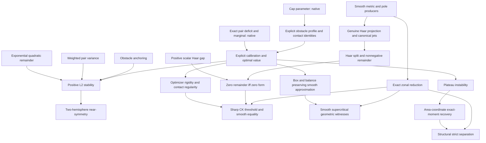

# Mathematical scope and dependency graph

This project is incomplete. The first native layer proves the all-cap parameter
and the generic exact deficit of the actual triangular functional. It does not
yet prove the optimizer, its optimal value, stability, or any geometric headline.
Independent outer acceptance is pending. The full six-part suite below remains
mandatory; only coupled evolution and the exact unrestricted threshold value are
optional research frontiers.

## Conventions and fixed mathematical targets

The variational domain is the continuous functions on `[0,1]` taking values in
`[0, log C]`, for every real `C ≥ 1`. Lean uses real functions with `ContinuousOn`
on that interval, and equality/uniqueness must be restricted to the interval.
The functional is the Lebesgue integral of `2s exp(k(v)−k(s))` over
`0 ≤ v < s ≤ 1`. `pairFunctional_congr` ensures exterior values are irrelevant.

The geometric class consists of the actual smooth metrics on the unit two-sphere
produced by globally smooth positive balanced profiles `a : ℝ → ℝ`, together with
smooth diffeomorphic pullbacks of those metrics. No abstract circle-action
classification is assumed. The pole factors must be produced with their tying
equations, and actual covariant jets must come from the Levi-Civita connection.
There is no equatorial reflection hypothesis. Meridian reflection is a distinct
isometry used for the two zonal components.

| Mandatory headline | Exact intended conclusion | Native status |
|---|---|---|
| Haar decomposition and meridional reduction | For every metric in the stated class and smooth one-form, `Q(h)=Q(Ph)+Q(h−Ph)`, `Q(h−Ph)≥0` without pinching; actual smooth zonal forms satisfy `Q(M(r)+Z(s))=2π(J_a[r]+J_a[s])`. | Open; historical statements inspected only. |
| All-cap optimum | For each `C≥1`, the specified continuous obstacle profile is admissible and minimizes the actual functional with value `2/3−β+1/(3β)`, where `q≥1` solves `log q+(2/3)(q³−1)=log C`, `α=(q⁴+2q)^(−1/2)`, `β=αq²`. | Parameter and generic deficit proved; explicit profile/calibration/value open. |
| Rigidity | Equality in the optimal bound holds exactly for that profile on `[0,1]`; `C=1` is the constant zero logarithmic profile. | Open. Parameter endpoint alone is proved. |
| Stability and near-symmetry | A positive explicit cap-dependent constant controls the squared `L²` distance; the two hemisphere deficits control reflection asymmetry without assuming symmetry. | Explicit source-only route derived; native proof open. |
| Sharp CK geometry | `C_CK=((5+√13)/3)^(1/3) exp((4+2√13)/9)` is safe for every CK form in the stated metric class; every larger cap contains a genuine smooth negative witness with strictly smaller curvature ratio. At the safe endpoint, equality for smooth CK forms is precisely the zero form, subject to proving the new Haar equality bridge. | Open, including the equality bridge and all geometric producers. |
| Structural separation | Plateau instability and valid geometric recovery give `C_rot<C_CK` for all one-forms in the same metric class, without a chosen rational intermediate cap. | Open. Exact unrestricted value is not claimed. |

The formulas and additional exact calculations appear in
[the calibration derivation](research/variational-calibration.md),
[the stability derivation](research/stability.md), and
[the geometric audit](research/geometry-audit.md). They are research records,
not established paper results. No manuscript currently claims these open results.

## Shared dependency graph

Each box has one mathematical role; shared nodes are not reimplemented per
headline. The next native layer should define the contacts and glued profile,
prove actual admissibility and its primitive formulas, and specialize the
already checked marginal identity. The variance and anchoring branches may be
formalized independently in bounded tasks. Geometry proceeds through real
producers, not by moving the historical aggregate into the new project.

## Corrected conventions and load-bearing risks

- For a balanced reciprocal-curvature profile, `f(v)=2∫ᵥ¹ ξa(ξ)dξ`, `H=f/a`,
  `K=1/a`, and the exact hemisphere substitution is `k(v)=log(M/a(v))`.
  Using `log a` reverses the pair ratio. The southern identity uses balance.
- The constant-probe normalization is
  `J_a[c]=[2(I(k₊)+I(k₋))−4/3]c²`, and geometric half-dissipation is `2πJ`.
  The metric and section-jet bridges remain native obligations.
- With area measured from the south pole,
  `f_K(x)=2x−2∫₀ˣ(x−s)K(s)ds`, hence `f_K''=−2K`, `f_K(0)=0`, `f_K'(0)=2`.
  On `[0,L]` the north-pole conditions require `∫K=2` and `∫sK=L`.
- The optimizer has derivative jumps at both contacts for `C>1`; the free arc
  collapses at `C=1`. Smooth nonattainment for constant probes alone cannot
  establish the full CK equality statement.
- A new positive scalar remainder is needed to prove
  `Q(h−Ph)=0 ↔ h−Ph=0`. The explicit polar square completion and proposed
  estimate with weight `1/b(z)` are recorded in the geometric audit, unproved
  in Lean. This is a genuine additional dependency, not an assumed equality law.
- General-probe action involves `a'`. Uniform approximation of `a` alone is
  insufficient for its convergence. Reconstruct the area-coordinate exact
  moment recovery and actual meridional action continuity instead.
- No smooth attainment at the unrestricted endpoint has been established.
  Static negative dissipation proves neither coupled-flow existence nor CK
  preservation along a flow.

## Pinned foundation and source provenance

DG is released `v0.1.4`, revision
`788efe97894474c032de6dfb1289d515f613d15a`; Mathlib is revision
`c55e6e786f49471c72fbddbec5415808896aec1e`; Lean is `v4.35.0-rc3`.
The DG checkout was clean when inspected. The existing native cache passed the
initial root build. All 291 copied historical file hashes were checked against
the reference inventory; agreement authenticates reference bytes, not proofs.

The release's `convexOn_integral` and
`DifferentialGeometry.Analysis.integral_norm_sub_average_sq_le_integral_norm_sub_sq`
were inspected directly. Neither substitutes for the weighted pair-variance and
constant-anchoring arguments required here. The optional parabolic infrastructure
has not been certified as a coupled Hodge-flow producer.

The parameter proof is new. The triangular functional and marginal method are
adapted from the owner's historical `PureRotationSharpThreshold.lean` and
`PureRotationSharpFunctional.lean`, retaining that attribution in the new source.
Those reference modules have no copyright/license header to copy. No historical
module or blanket linter disable is imported. New file headers preserve the
private project's absence of a license grant; the header linter remains enabled
with its expected license text configured accordingly.
